# StockLookup
## 📘 Overview

**StockLookup** is a user-friendly web application that enables users to quickly search and view detailed stock market data using a stock ticker symbol. Built with Flask and modern web technologies, this app fetches real-time data from multiple APIs including Tiingo and DefeatBeta to provide users with a comprehensive interface to view company details, stock summaries, and recent search history.

---

## ✨ Features

- **Stock Lookup**: Enter any ticker symbol to instantly retrieve company information and recent stock performance.
- **Real-Time Data**: Powered by Tiingo API and DefeatBeta API to ensure accurate and up-to-date stock market information.
- **Search History**: Automatically saves your latest searches for easy reference.
- **Tabbed Interface**: Seamlessly switch between Company Outlook, Stock Summary, and Search History.
- **Investment Tools**: Portfolio tracker, company comparison, and performance calculator.
- **Personal Notes**: Add and manage notes for each stock.
- **Theme Toggle**: Switch between light and dark themes.

---

## 🖼️ Screenshots

### 1. Main Search Interface
The primary search page where users can enter stock ticker symbols to retrieve real-time market data.

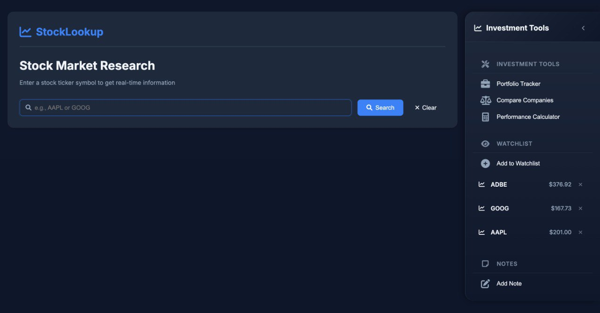

### 2. Company Outlook Tab
Displays comprehensive company information including business description, industry, sector, and key metrics.

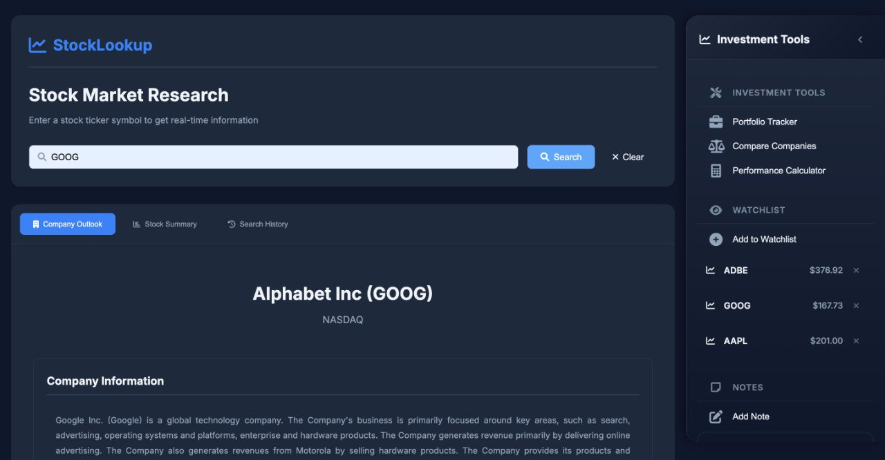

### 3. Stock Summary Tab
Shows current stock price, change percentage, volume, and other key financial metrics.

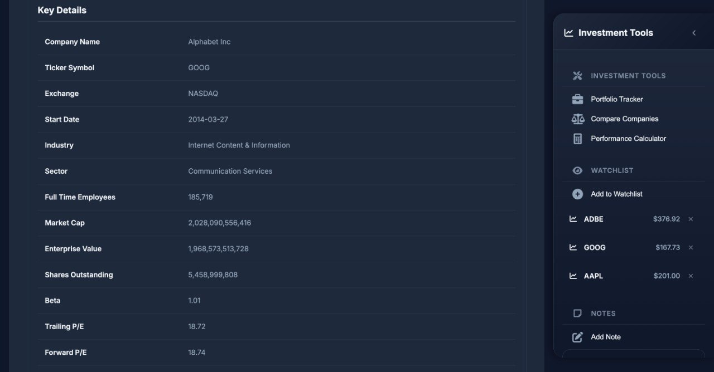

### 4. Daily Returns and Market Risk
Shows the market risk for the particular stock and the hisorical data of the returns.

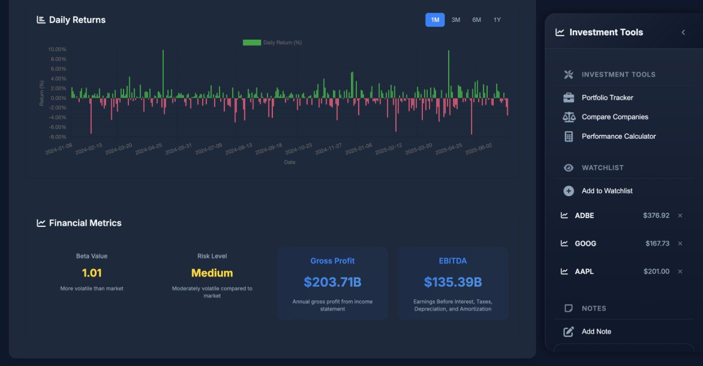

### 5. Search History Tab
Lists all previous stock searches with timestamps for easy reference and quick access.

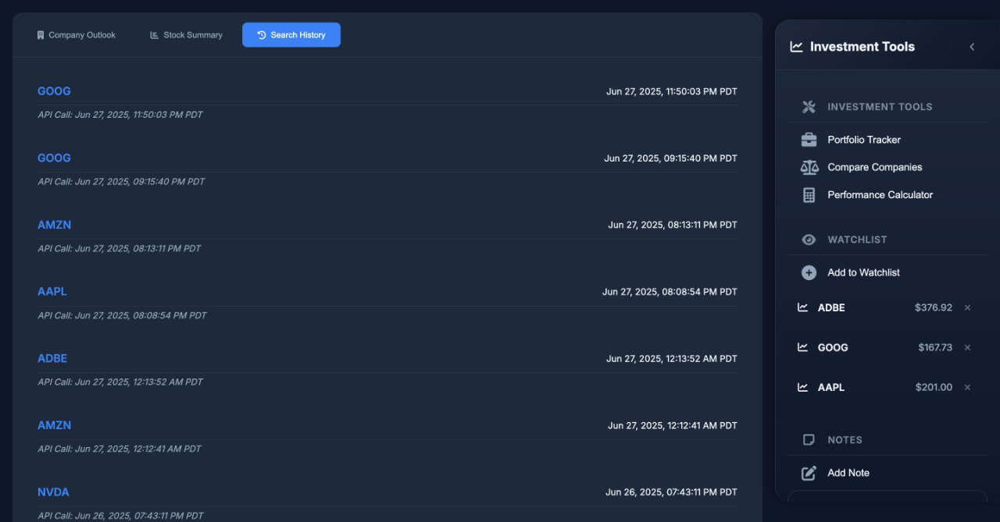

### 6. Portfolio Tracker
Allows users to track their investment portfolio with real-time value and performance metrics.

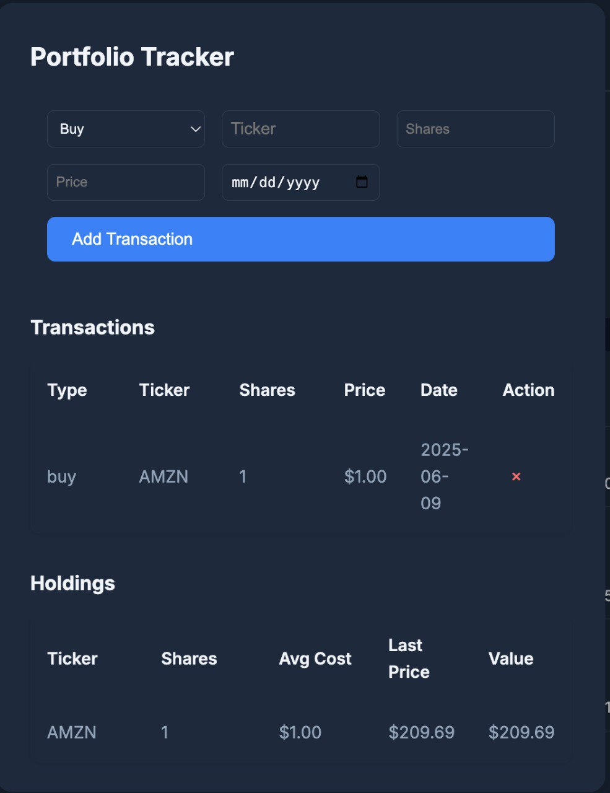

### 7. Company Comparison
Tool for comparing multiple companies side-by-side to make informed investment decisions.

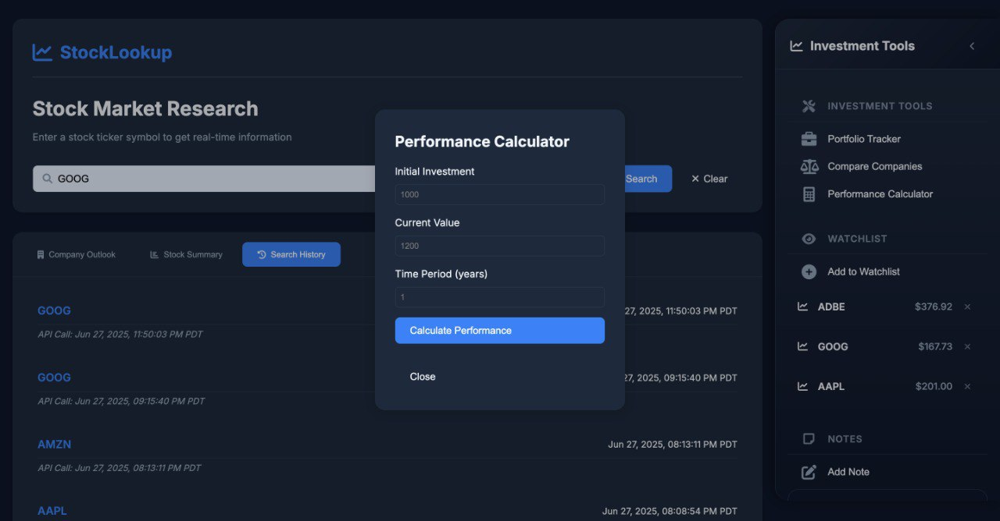
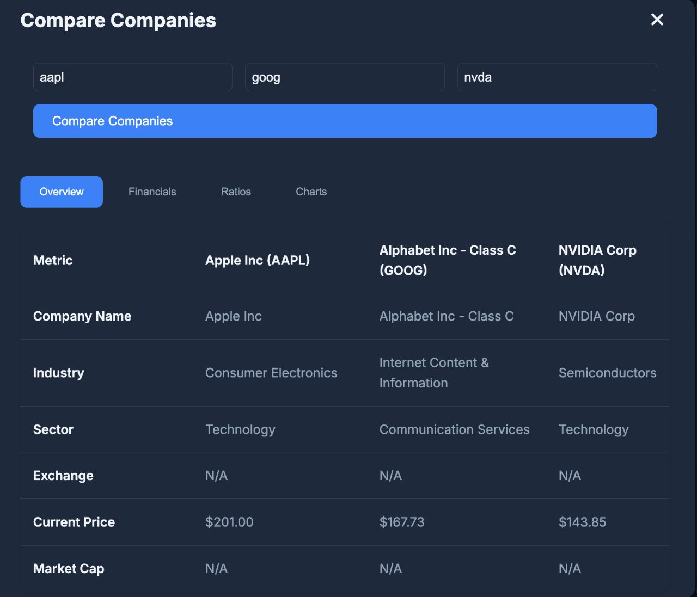


### 8. Investment Tools Sidebar
Right sidebar containing various investment tools and features for enhanced stock analysis.

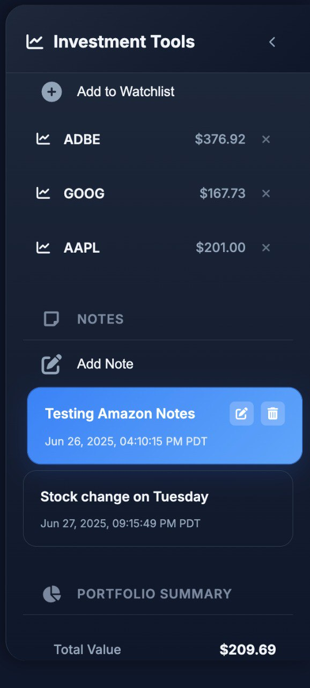

### 9. Toggle between Theme Interfaces
Toggle between light and dark themes for comfortable viewing in different lighting conditions.

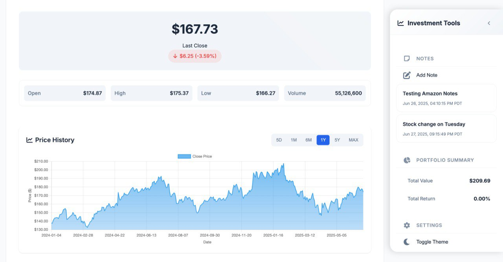

### 10. Notes Feature
Add and manage personal notes and annotations for each stock in your portfolio.

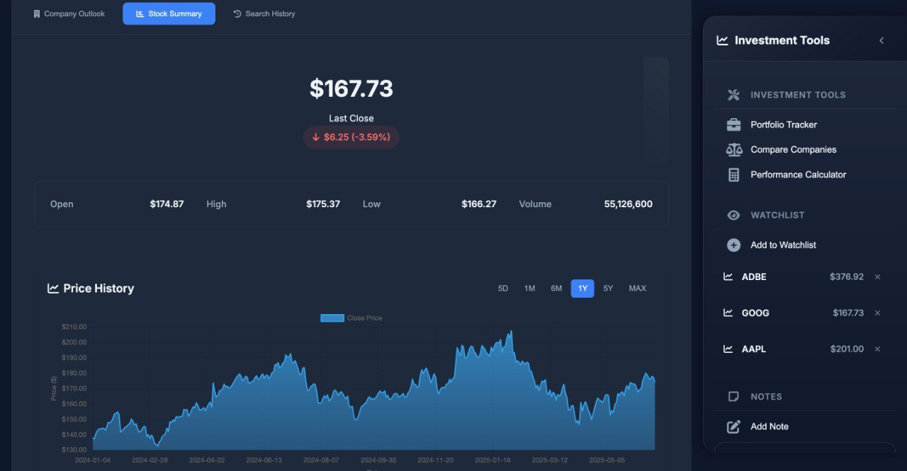

---

## 🧰 Requirements

- Python 3.x
- Flask
- SQLite
- Requests
- Pandas
- NumPy
- DefeatBeta API
- BeautifulSoup4

---

## 🚀 Installation & Setup

### 1. Clone the Repository

```bash
git clone https://github.com/FortuneDayZ/Stock-Lookup.git
cd Stock-Lookup
```

### 2. Set Up Virtual Environment

```bash
python -m venv venv
source venv/bin/activate  # On Windows use: venv\Scripts\activate
```

### 3. Install Dependencies

```bash
pip install -r requirements.txt
```

### 4. Configure Tiingo API

Sign up at [Tiingo](https://www.tiingo.com/) to obtain a free API key.

Replace the placeholder in `app.py` with your API key:

```python
TIINGO_API_KEY = "YOUR_TIINGO_API_KEY"
```

### 5. Run the Application

```bash
python app.py
```

Visit the app in your browser at:

```
http://127.0.0.1:5001
```

---

## 🗂 Project Structure

```
Stock-Lookup/
├── venv/                    # Virtual environment directory (after setup)
├── app.py                  # Main Flask application
├── templates/
│   └── index.html          # Front-end HTML page
├── static/
│   ├── chart-line-favicon.svg  # Application favicon
│   ├── script.js           # JavaScript functionality
│   └── styles.css          # CSS styling
├── Screenshots/            # Application screenshots
├── search_history.db       # SQLite DB for storing search history
├── requirements.txt        # Python dependencies
└── README.md               # This file
```

---

## 🧪 Usage

1. Enter a stock ticker (e.g., `AAPL`) and click **Search**.
2. Navigate between tabs to view:
   - **Company Outlook**
   - **Stock Summary**
   - **Search History**

---

## 🛠 Troubleshooting

- Make sure the Tiingo API key is active and correctly added.
- Double-check your virtual environment is activated.
- If `search_history.db` doesn't exist, it will be created on first app run.

---

## 📄 License

This project is open-source. Feel free to modify, distribute, and use it in your own applications.
